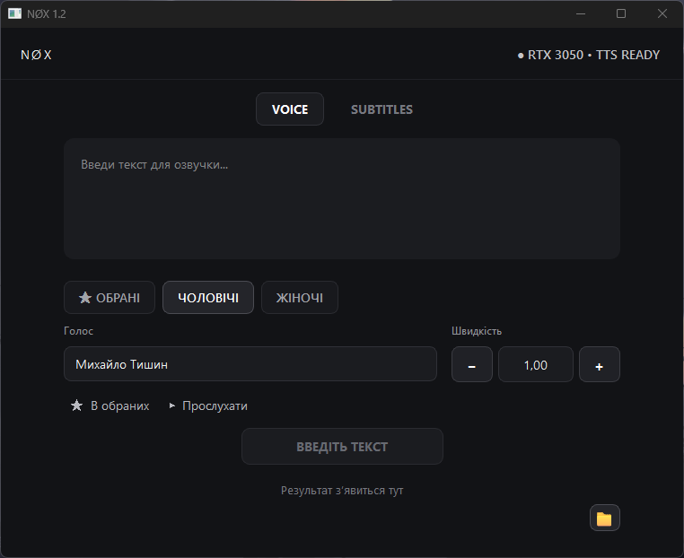
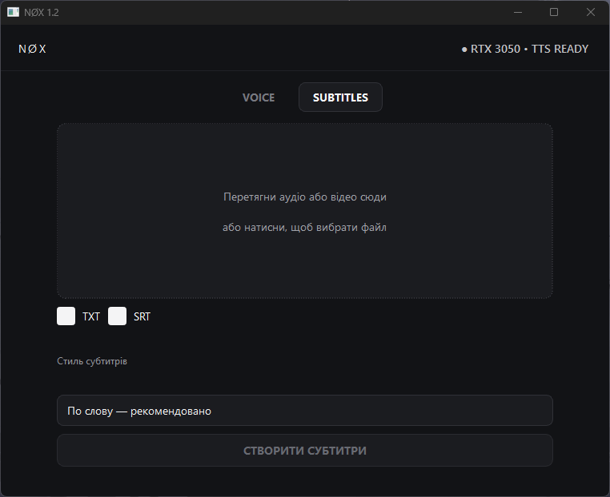

# NØX

### Локальний AI для українського голосу та субтитрів

Windows-додаток для синтезу українського мовлення,
розпізнавання аудіо та створення субтитрів.

[**Завантажити NØX 1.2 →**](https://github.com/nthngreal/NOX/releases/latest)

  
  

---

## Що таке NØX?

NØX переносить синтез українського мовлення та створення
субтитрів безпосередньо на ваш ПК.

Після початкового встановлення AI-компонентів обробка
виконується локально. Аудіо не потрібно надсилати
до хмарного сервісу.

## Можливості

| | |
|---|---|
| 🇺🇦 **31 український голос** | Синтез природного українського мовлення |
| 🎙️ **Розпізнавання мовлення** | Перетворення аудіо на текст локально |
| 📝 **TXT / SRT** | Створення субтитрів з аудіо |
| 🔒 **Локальна обробка** | AI працює на вашому ПК |
| ⚡ **NVIDIA GPU** | Апаратне прискорення |

## VOICE

Перетворюйте український текст на природне мовлення
за допомогою локальних голосів.

**Текст → українське мовлення → аудіо**

## SUBTITLES

Перетворюйте аудіо на текст та створюйте файли субтитрів.

**Аудіо → розпізнавання → TXT / SRT**

## Системні вимоги

- Windows 10 / 11 x64
- NVIDIA GPU
- NVIDIA Driver
- Підключення до Інтернету для початкового встановлення AI-компонентів

> Після встановлення AI-компонентів обробка виконується локально.

## Встановлення

1. Завантажте останню версію NØX.
2. Запустіть `NOX_Setup_1.2.exe`.
3. Пройдіть майстер встановлення.
4. Дочекайтеся підготовки локальних AI-компонентів.
5. Запустіть NØX.

[**Завантажити NØX 1.2 →**](https://github.com/nthngreal/NOX/releases/latest)

## Скріншоти

Тут додамо реальні скріншоти NØX.

## Реліз

**NØX 1.2**

SHA256:

`62FFD87F315D154C8807D26071CA9A031AD6E5286DEFCB83F49E46271621B10B`
